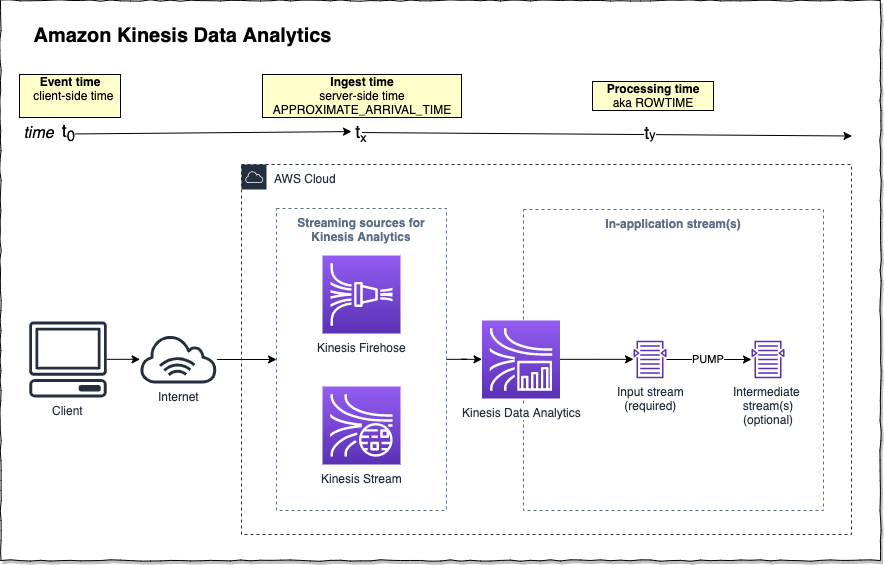

# aws-kinesis-analytics-event-time-diagram
Diagram to help visualize the various timestamps that are relevant to an Amazon Kinesis Data Analytics application.

## Diagram

## Understanding Time in Amazon Kinesis Analytics

There are three times relevant to an Amazon Kinesis Analytics application:

* **Event time** - aka **client-side time**, the actual time that an event took place. If needed, you are responsible for measuring this in your client code and including it as an attribute (with a name of your choice) sent to your streaming source. Note that client apps (mobile, web, etc.) may not always have reliable clocks.

* **Ingest time** - aka **server-side** time, this is the time that your streaming source (either a Kinesis Stream or Kinesis Firehose) received your event. This timestamp is automatically tracked by Kinesis and inserted into your corresponding Kinesis Stream or Firehose records as `APPROXIMATE_ARRIVAL_TIME`. This is usually very close to the real event time, but in rare cases it may be inacurrate or events may be out of order. 

* **Processing time** - this is the time that Kinesis Analytics first inserts a record from your streaming source (Kinesis Streams or Firehose) into your analytics application's input stream and is provided as the `ROWTIME` attribute. 

There are pros and cons to each timestamp, and AWS best practices recommend using a combination of processing time and either event or ingest time. [Refer to the AWS Kinesis Analytics documentation for details](https://docs.aws.amazon.com/kinesisanalytics/latest/dev/timestamps-rowtime-concepts.html).